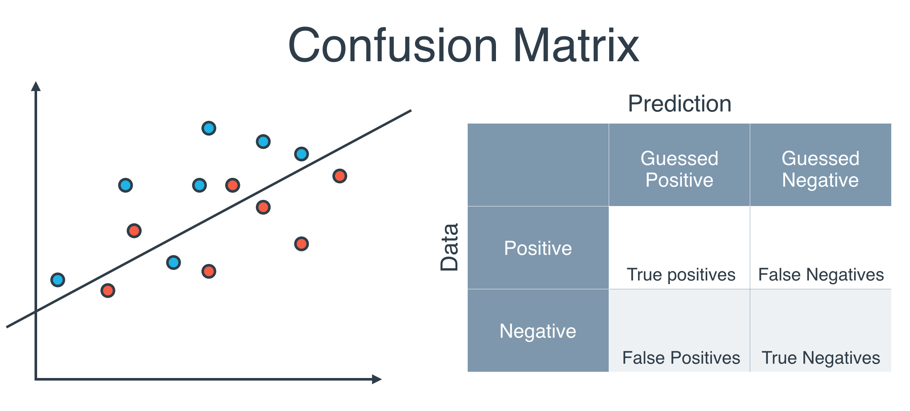
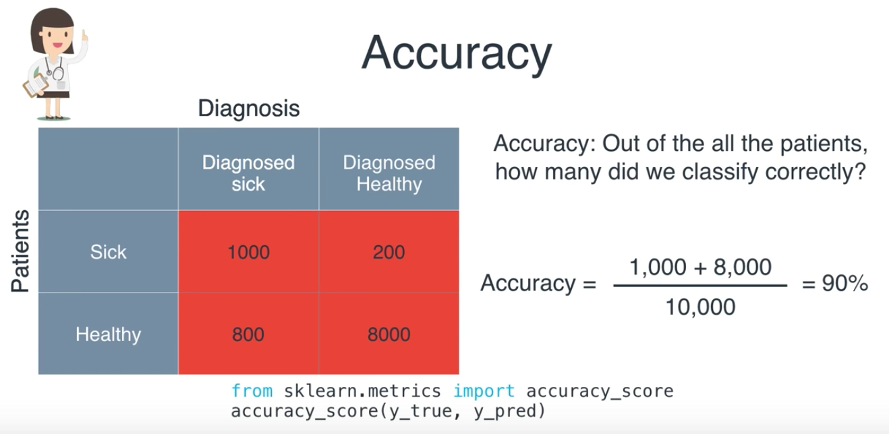
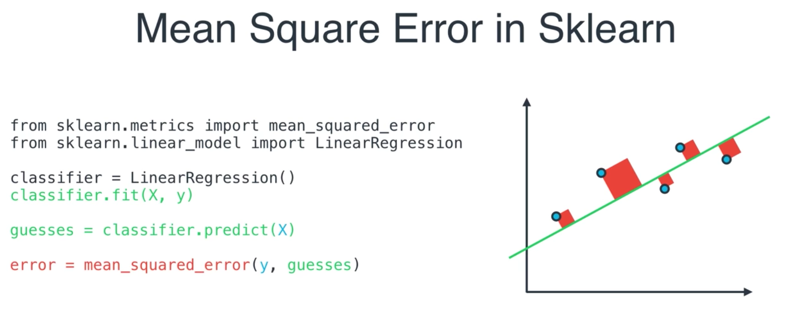
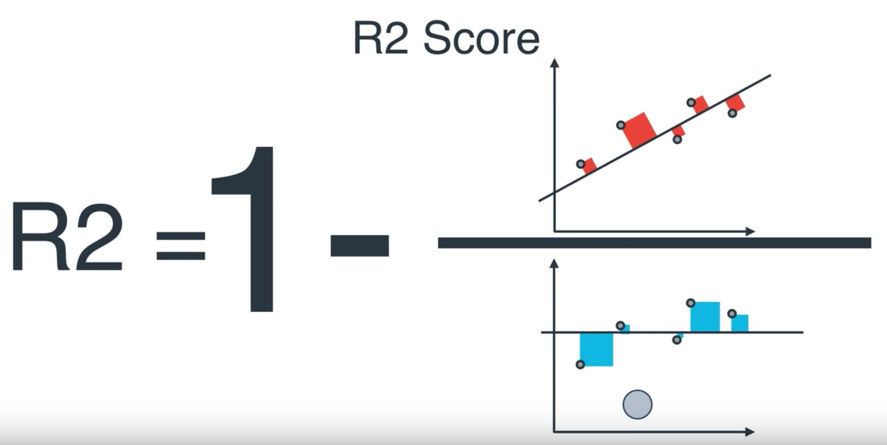
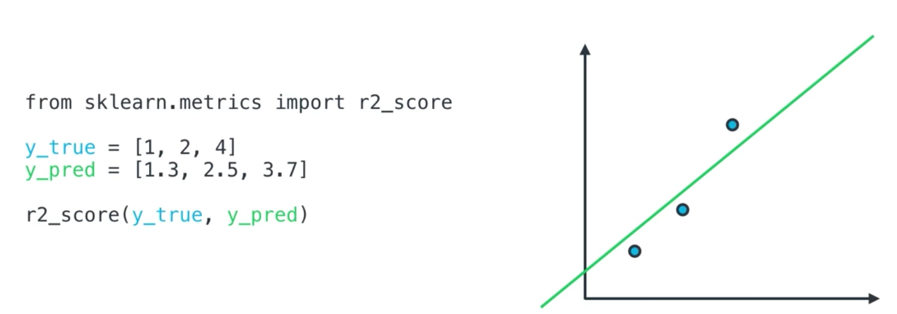
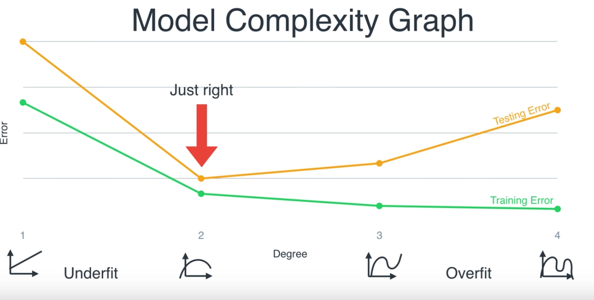
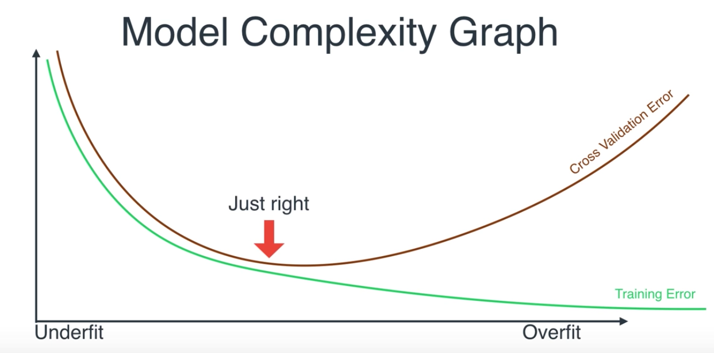

* normalization
* enumerate the categorical data into 1s and 0s for all the options

## split data set
```python
from sklearn.model_selection import train_test_split
X_train, X_test, y_train, y_test = train_test_split(X, y, test_size=0.2, random_state=42)
```

## confusion matrix



## accuracy


## mean absolute error 


## R2 score
evaluate the linear regression model with the average simplistic model



## type of errors
* underfitting : too simple, due to bias
* overfitting: too specific for training set, too much variance

## model complexity graph




## cross validation
use KFold in sklearn

http://scikit-learn.org/stable/modules/generated/sklearn.model_selection.KFold.html
