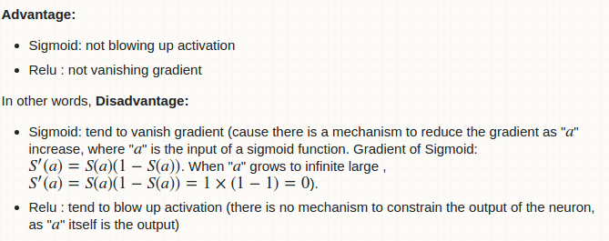

## activation functions
* sigmoid : binary class
* softmax : multiple different classes

[wiki link] (https://en.wikipedia.org/wiki/Activation_function)

## sigmoid vs  relu

## nonlinear activation
* https://www.tensorflow.org/api_docs/python/tf/contrib/layers/fully_connected
* https://www.quora.com/What-is-special-about-rectifier-neural-units-used-in-NN-learning
* https://www.quora.com/What-is-the-vanishing-gradient-problem
* http://cs231n.github.io/neural-networks-1/
