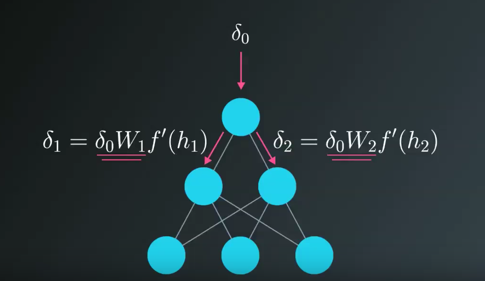
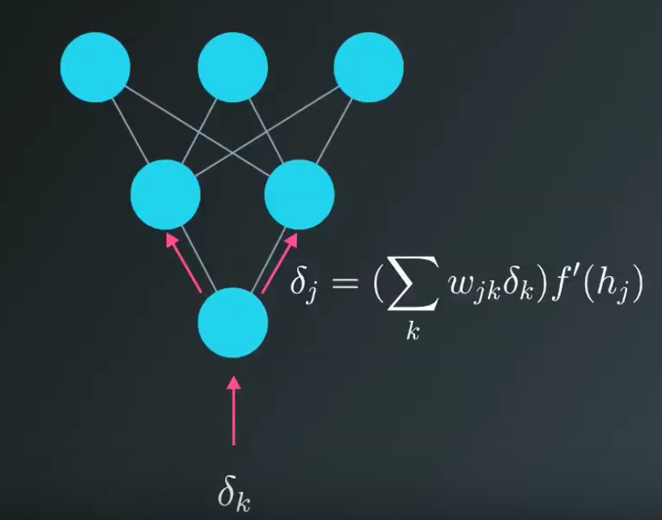

## gradient descent


A good value for the scale is $1/\sqrt{n}$ where n is the number of input units. 
This keeps the input to the sigmoid low for increasing numbers of input units.
```python
weights = np.random.normal(scale=1/n_features**-.5, size=n_features)
```

## backpropgation




## References
* udacity deep learning 101
