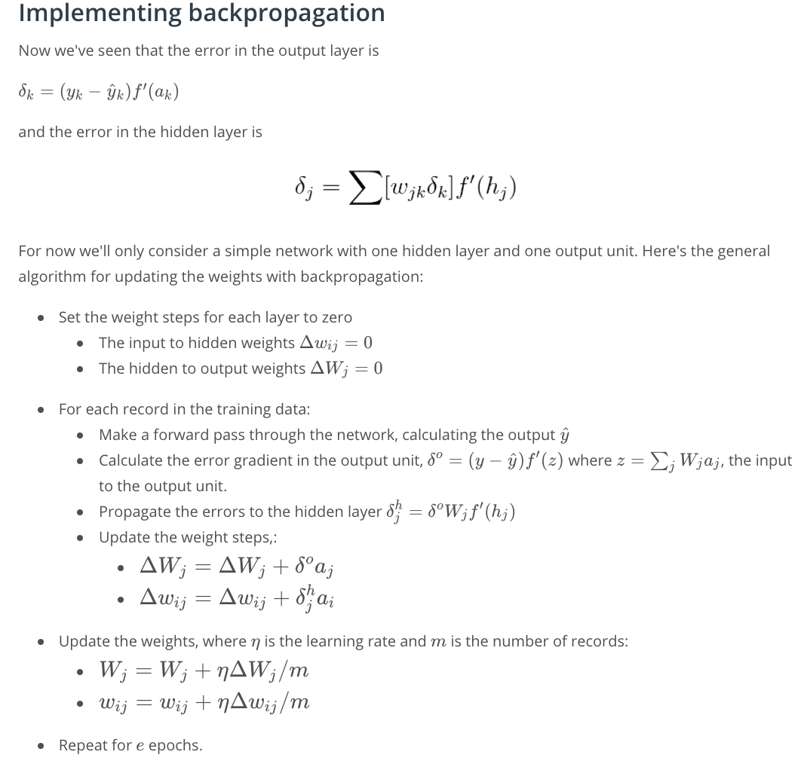

## gradient descent


A good value for the scale is $1/\sqrt{n}$ where n is the number of input units. 
This keeps the input to the sigmoid low for increasing numbers of input units.
```python
weights = np.random.normal(scale=1/n_features**-.5, size=n_features)
```

## backpropgation




## Further reading
Backpropagation is fundamental to deep learning. TensorFlow and other libraries will perform the backprop for you, but you should really really understand the algorithm. We'll be going over backprop again, but here are some extra resources for you:

* From Andrej Karpathy: Yes, you should understand backprop[link](https://medium.com/@karpathy/yes-you-should-understand-backprop-e2f06eab496b#.qwlupnnod)
* Andrej Karpathy, a lecture from Stanford's CS231n course [link](https://www.youtube.com/watch?v=59Hbtz7XgjM)

## References
* udacity deep learning 101
